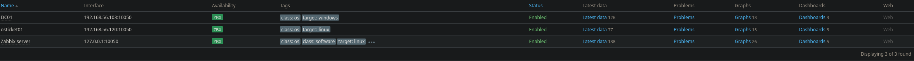
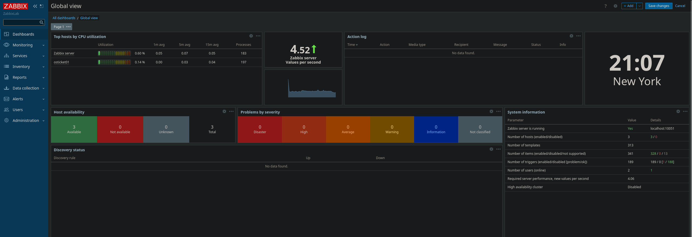

# Architecture and Monitoring Design

## Overview

This monitoring environment was designed to simulate how a centralized Network Operations Center (NOC) maintains operational visibility across critical enterprise systems.

Zabbix was intentionally positioned as a **proactive monitoring and alerting layer**, not a configuration management tool or a metric exhaust pipe. The focus of this design was to provide timely, actionable insight into system health while minimizing alert fatigue and operational noise.

Rather than monitoring every available metric, the architecture emphasizes:
- Service availability
- Resource exhaustion risks
- Infrastructure dependencies
- Predictable alert behavior

This approach reflects how monitoring is used in production environments where clarity and response time matter more than raw data volume.

## High-Level Architecture

The monitoring stack consists of a centralized Zabbix server responsible for data collection, alert evaluation, and visualization, supported by lightweight agents installed on monitored hosts.

### Core Components

- **Zabbix Server (`zabbix01`)**
  - Operating System: Ubuntu Server
  - Web Frontend: Apache
  - Database Backend: MariaDB
  - Monitoring Method: Zabbix Agent (active and passive checks)

- **Monitored Hosts**
  - Windows Server systems using the Zabbix Agent for Windows
  - Linux systems using the Zabbix Agent for Linux
  - All hosts configured with static IP addressing

The environment operates within a VirtualBox host-only network to ensure predictable connectivity and isolation from external dependencies.

## Network and Communication Model

Agent-based monitoring was selected to mirror common enterprise deployments and to allow for both active and passive data collection.

### Communication Flow

- Zabbix Agents communicate outbound on **TCP 10050**
- Zabbix Server listens for agent data and manages checks on **TCP 10051**
- All monitoring traffic remains internal to the lab network

This design ensures:
- Deterministic connectivity
- Minimal firewall complexity
- Clear separation between monitoring traffic and application traffic

## Dependency-Oriented Design

Monitoring decisions were guided by service dependencies rather than isolated host metrics.

Key dependency relationships include:

- **Active Directory** as a foundational service supporting authentication and authorization
- **File Services** supporting user workflows and application storage
- **Helpdesk Application (osTicket)** representing a user-facing service dependent on both identity and infrastructure layers

The monitoring design assumes that failures rarely occur in isolation. Alerts were evaluated with an understanding that upstream failures can manifest as downstream symptoms.

## Template Strategy

Standard Zabbix templates were used as the baseline to maintain consistency and realism.

- **Windows by Zabbix agent**
- **Linux by Zabbix agent**

Templates were not heavily modified. This was intentional.

The goal was to demonstrate:
- Practical use of vendor-supported templates
- Validation of monitoring readiness at the OS level
- Awareness of what monitoring can and cannot infer without customization

This reflects real-world environments where excessive template modification often introduces complexity without proportional operational benefit.

## Self-Monitoring

The Zabbix server was configured to monitor itself using Linux templates.

This provided:
- Visibility into the health of the monitoring platform
- Assurance that alerting failures would not go unnoticed
- A realistic representation of how NOC tools are treated as production systems

## Design Rationale Summary

This architecture prioritizes:
- Operational clarity over metric volume
- Dependency awareness over host isolation
- Stability and predictability over experimentation

The result is a monitoring environment that behaves consistently, generates meaningful alerts, and supports realistic NOC workflows.
