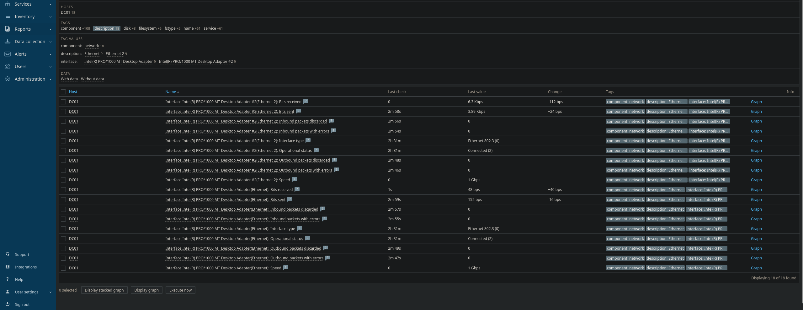

# Agent Strategy: Windows vs Linux

## Overview

This environment uses the Zabbix Agent as the primary monitoring mechanism across both Windows and Linux systems.

While the same monitoring platform and conceptual approach were applied consistently, agent behavior and readiness differed meaningfully between operating systems. These differences informed onboarding expectations, validation steps, and troubleshooting practices.

The purpose of this section is not to compare operating systems philosophically, but to document how platform-specific characteristics affect monitoring outcomes in enterprise environments.

## Agent-Based Monitoring Rationale

Agent-based monitoring was selected to provide:
- Reliable host-level metrics
- Reduced dependency on external polling mechanisms
- Consistent data collection across heterogeneous systems

Agents were configured to support both **active** and **passive** checks, allowing the monitoring server to balance flexibility with predictability.

## Windows Agent Considerations

### Instrumentation Dependencies

On Windows systems, Zabbix relies heavily on native performance counters exposed by the operating system.

As a result:
- Agent installation alone does not guarantee full metric availability
- OS-level instrumentation must be functional and accessible
- Monitoring readiness is tied directly to system configuration health

This dependency became visible during onboarding of infrastructure hosts, reinforcing the importance of validating Windows monitoring prerequisites.

### Operational Implications

Windows monitoring introduced:
- Additional validation steps during onboarding
- A greater emphasis on baseline verification
- The need to distinguish between monitoring issues and system issues

These characteristics reflect real-world enterprise environments, where monitoring often surfaces underlying OS inconsistencies rather than introducing them.

## Linux Agent Considerations

### Predictable Metric Availability

Linux systems provided immediate access to expected metrics following agent deployment.

Key characteristics included:
- Minimal reliance on external instrumentation layers
- Consistent metric naming and availability
- Predictable agent behavior across hosts

This resulted in faster onboarding and reduced troubleshooting overhead.

### Operational Implications

Linux monitoring reinforced:
- The value of standardized system configurations
- Lower variance in monitoring behavior
- Clear separation between monitoring issues and application issues

These characteristics make Linux hosts well-suited for environments requiring rapid visibility with minimal tuning.

## Template Usage and Consistency

Standard vendor-supported templates were applied to both Windows and Linux hosts:
- **Windows by Zabbix agent**
- **Linux by Zabbix agent**

Templates were intentionally left largely unmodified.

This decision was made to:
- Preserve supportability
- Avoid introducing unnecessary complexity
- Demonstrate practical use of widely deployed monitoring standards

Where discrepancies appeared, resolution focused on host readiness rather than template customization.

## Active vs Passive Checks

Both active and passive checks were utilized to:
- Support flexible data collection models
- Reduce monitoring blind spots
- Reflect common enterprise deployment patterns

This hybrid approach allowed hosts to report data proactively while still supporting server-initiated checks where appropriate.

## Lessons Learned

Key observations from agent deployment included:
- Monitoring effectiveness is constrained by host readiness
- OS-level consistency simplifies monitoring outcomes
- Agent behavior varies significantly across platforms even when using identical tooling

These lessons reinforce the importance of platform-aware monitoring strategies in mixed environments.

## Summary

Using a single monitoring platform across Windows and Linux systems highlighted meaningful operational differences that influence monitoring reliability, onboarding effort, and troubleshooting complexity.

Documenting these differences provides context for alert behavior and reinforces why monitoring must be evaluated holistically rather than tool-by-tool.
