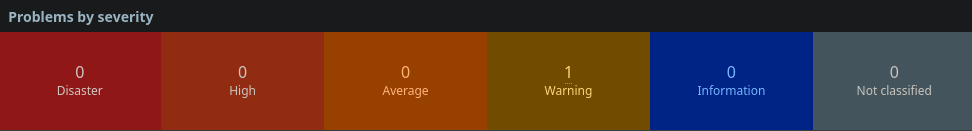
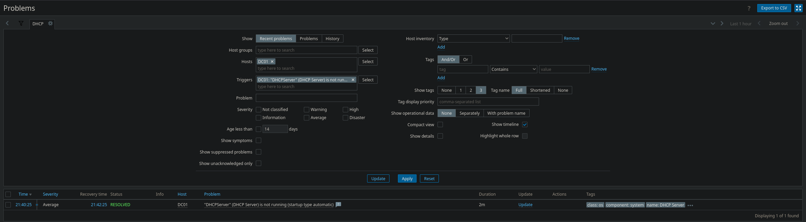

# Alerting and Operational Intent

## Alerting Philosophy

Alerting in this environment was designed to support **decision-making**, not data awareness.

The goal was not to detect every deviation from normal behavior, but to surface conditions that represent:
- Service unavailability
- Imminent service degradation
- Resource exhaustion requiring intervention

Alerts were treated as **signals requiring action**, not informational messages or performance curiosities.

## Operational Priorities

Alerting was aligned with the following operational priorities:

1. Detect loss of availability quickly
2. Identify conditions that threaten stability
3. Minimize alert fatigue
4. Preserve confidence in alert legitimacy

This reflects standard NOC practice, where excessive or low-value alerts reduce response quality over time.

## Alert Scope and Focus

Alerting coverage focused on a limited set of high-impact conditions:

- Host availability (up/down)
- Sustained resource exhaustion (CPU, memory, disk)
- Agent connectivity and data freshness

Application-level alerting was intentionally minimal. The emphasis was placed on platform health rather than deep application introspection, mirroring environments where application monitoring is layered progressively.

## Baseline-First Approach

Thresholds were not aggressively tuned during initial deployment.

Instead:
- Metrics were observed over time
- Normal operating ranges were established
- Alert thresholds were evaluated relative to observed behavior

This baseline-first approach reduces false positives and ensures that alerts represent abnormal conditions rather than expected fluctuations.

## Severity and Escalation Model

Alerts were categorized using standard Zabbix severity levels.

Severity reflected **operational impact**, not technical detail.

For example:
- Availability loss represented higher urgency than transient utilization spikes
- Sustained resource exhaustion was prioritized over momentary peaks

This severity model supports effective triage and aligns alert urgency with response expectations.

## Alert Lifecycle

Alerts followed a predictable lifecycle:

1. Triggered based on defined conditions
2. Visible on the global dashboard
3. Acknowledged by an operator
4. Reviewed for root cause and resolution

This lifecycle reinforces accountability and prevents alerts from becoming background noise.

## Noise Reduction Strategies

Several deliberate choices were made to reduce alert noise:

- Avoidance of overly sensitive thresholds
- Preference for sustained conditions over instantaneous values
- Limiting alert scope to actionable scenarios

As a result, alert volume remained low and meaningful, reinforcing operator trust in the monitoring system.

## Operational Outcomes

Alerting behavior during validation confirmed that:
- Alerts triggered as expected under defined conditions
- No excessive or misleading alerts were generated
- The global dashboard provided immediate situational awareness

This validated that alerting logic aligned with operational intent rather than theoretical completeness.

## Summary

Alerting within this environment was intentionally conservative, role-focused, and aligned with real-world NOC workflows.

By prioritizing clarity and actionability over coverage, the monitoring system provides reliable signals that support timely and confident response.
