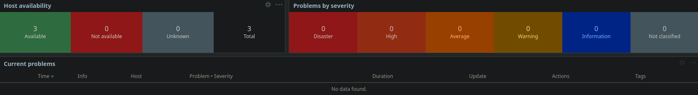
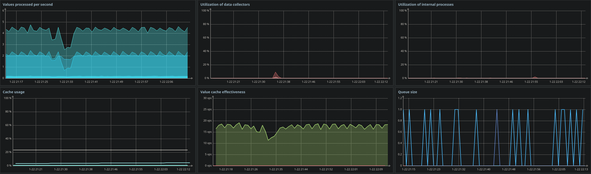

# Validation and Observed Behavior

## Validation Approach

Validation of the monitoring environment focused on confirming that observed system behavior aligned with the original design intent.

Rather than validating individual metrics in isolation, validation emphasized:
- End-to-end monitoring behavior
- Alert visibility and clarity
- Predictability under normal and degraded conditions

The objective was to ensure that monitoring outputs were operationally meaningful and consistent with NOC expectations.

## Host and Agent Validation

All monitored hosts were validated for:
- Agent availability
- Continuous data collection
- Accurate host status reporting

Agents on both Windows and Linux systems reported data consistently once onboarding prerequisites were met. No intermittent connectivity issues or unexplained data gaps were observed during normal operation.

This confirmed that agent-based monitoring was stable across heterogeneous platforms.

## Metric Collection Behavior

Observed metric behavior aligned with expectations:

- Resource utilization metrics updated at expected intervals
- No unexpected spikes or erratic reporting were observed
- Data freshness indicators remained within acceptable ranges

Metrics reflected real system activity rather than synthetic or placeholder values, reinforcing confidence in monitoring accuracy.

## Alert Validation

Alerting behavior was validated through controlled scenarios designed to test trigger logic and alert visibility.

Observed behavior included:
- Alerts triggering only when defined conditions were met
- Clear identification of affected hosts
- Appropriate severity classification
- Visibility on the global dashboard

Alerts were acknowledged and resolved to validate the full alert lifecycle.

No excessive or spurious alerts were generated during validation, confirming that alert thresholds were appropriately conservative.

## Dashboard and Visibility Validation

The global dashboard provided immediate situational awareness during both normal operation and alert conditions.

Key observations:
- Host availability was clearly represented
- Active problems were immediately visible
- Monitoring platform health remained observable at all times

The dashboard supported rapid assessment without requiring deep navigation into host-specific views.

## Observed Stability

During extended observation:
- Monitoring remained stable
- No monitoring-induced performance impact was observed
- No unexplained alert noise occurred

This stability reinforced that the monitoring configuration was suitable for sustained operation rather than short-term demonstration.

## Validation Outcomes

Validation confirmed that:
- Monitoring behavior aligned with architectural and operational intent
- Alerts represented actionable conditions
- The system remained interpretable under both normal and degraded states

These outcomes demonstrate that the monitoring environment is functional, intentional, and operationally credible.

## Summary

The validation process confirmed that the Zabbix deployment behaves predictably and reliably in support of NOC-style operations.

By validating behavior rather than individual configurations, this lab demonstrates a monitoring system that can be trusted to support real-world decision-making.
